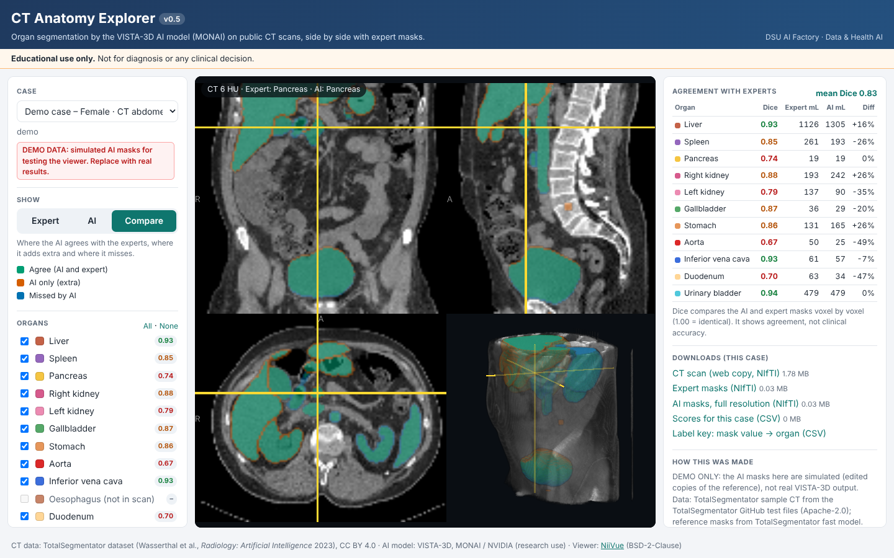

# CT Anatomy Explorer

An educational web app that shows how an AI model outlines organs on CT scans and how closely it agrees with
expert outlines. Built with **MONAI** (the open-source medical-imaging AI framework) and the **VISTA-3D** model,
on public CT scans from the **TotalSegmentator** dataset. Runs in any browser, including phones.

> **Educational use only.** Not for diagnosis or any clinical decision.


*Screenshot with the built-in demo data (simulated AI masks). Real VISTA-3D results replace it on Day 2.*

## What it does

| Feature | Details |
|---|---|
| 12 organs | liver, spleen, pancreas, right and left kidney, gallbladder, stomach, aorta, inferior vena cava, oesophagus, duodenum, urinary bladder |
| Three views of the masks | **Expert** (reference), **AI** (VISTA-3D) and **Compare** (agree / AI-only / missed) |
| Scan viewer | axial, coronal, sagittal and 3D; CT windows for abdomen, lung and bone; radiology orientation |
| Teaching aids | tick organs on or off; click an organ name to jump to it; read the organ under the cursor |
| Numbers | Dice overlap and volumes (mL) per organ, plus automatic warnings for likely bugs |
| Downloads | CT copy, expert masks, full-resolution AI masks, scores (CSV), label key |

## Repository layout

```
docs/                 the website (GitHub Pages serves this folder)
  index.html, app.js, app.css
  vendor/niivue.umd.js  NiiVue viewer library (BSD-2-Clause, kept here so the site has no outside dependencies)
  data/               scans + cases.json  (demo data now; replaced by real results)
notebooks/            ct_anatomy_explorer_kaggle.ipynb  - runs the AI pipeline on a free Kaggle GPU
pipeline/             the same pipeline as Python modules (for a rented GPU or a lab PC)
tools/build_notebook.py   rebuilds the notebook after editing pipeline/
tests/test_pipeline.py    quick checks, no GPU needed
guide/INTERN_GUIDE.md     day-by-day plan for the team
```

## Quick start

**1. Run the AI pipeline (Kaggle, free GPU).**
Kaggle → *Create* → *New Notebook* → *File* → *Import Notebook* → upload `notebooks/ct_anatomy_explorer_kaggle.ipynb`.
In *Session options* turn on **GPU T4 x2** and **Internet**. Run the cells in order. The last cell creates
`outputs/web_data.zip`.

**2. Put the results into the website.**
Delete `docs/data/`, then unzip `web_data.zip` inside `docs/` (it contains a fresh `data/` folder).
To keep only your best scans: `python tools/select_cases.py docs/data <id1> <id2> ...`

**3. Publish.** On GitHub: *Settings* → *Pages* → *Deploy from a branch* → branch `main`, folder `/docs` → *Save*.
After a minute or two the site is live at `https://<your-account>.github.io/<repo-name>/`.

**Preview on your own computer:**

```bash
python -m http.server -d docs 8000      # then open http://localhost:8000
```

(Opening `index.html` by double-clicking does not work, because browsers block loading the scan files that way.)

**Run the pipeline on a rented GPU (e.g. NVIDIA Brev) instead of Kaggle:**

```bash
pip install "monai==1.6.1" nibabel pytorch-ignite einops fire huggingface_hub requests scipy matplotlib
python -m pipeline.run_all --n-cases 10 --n-web 5      # results in outputs/, zip in outputs/web_data.zip
python tests/test_pipeline.py                          # quick self-check
```

## How it works

1. **Data** – downloads the TotalSegmentator small subset (102 CT scans with expert-checked masks; Zenodo record 10047263).
2. **Case selection** – ranks scans by how many of the 12 organs are fully inside the image (`outputs/curation.csv`).
3. **AI** – runs the MONAI `vista3d` bundle with label prompts for the 12 organs, one scan per process.
4. **Scores** – Dice and volumes per organ; warnings for label mix-ups and left/right swaps.
5. **Export** – crops and resamples each scan (default 2 mm) so the site loads quickly; writes `cases.json`.
6. **Viewer** – a static web page using NiiVue; the comparison view is computed in the browser.

| Our value | Organ | VISTA-3D label | TotalSegmentator file |
|---:|---|---:|---|
| 1 | Liver | 1 | liver |
| 2 | Spleen | 3 | spleen |
| 3 | Pancreas | 4 | pancreas |
| 4 | Right kidney | 5 | kidney_right |
| 5 | Left kidney | 14 | kidney_left |
| 6 | Gallbladder | 10 | gallbladder |
| 7 | Stomach | 12 | stomach |
| 8 | Aorta | 6 | aorta |
| 9 | Inferior vena cava | 7 | inferior_vena_cava |
| 10 | Oesophagus | 11 | esophagus |
| 11 | Duodenum | 13 | duodenum |
| 12 | Urinary bladder | 15 | urinary_bladder |

**About the scores.** Dice measures overlap between the AI and expert masks (1.00 = identical). VISTA-3D was trained on
large public CT collections that may include scans like these, so the scores show *agreement*, not clinical accuracy.

## Credits and licences

- **CT scans and expert masks:** TotalSegmentator dataset – Wasserthal J. et al., *TotalSegmentator: Robust Segmentation
  of 104 Anatomic Structures in CT Images*, Radiology: Artificial Intelligence, 2023. Licence CC BY 4.0.
- **AI model:** VISTA-3D, MONAI Model Zoo bundle `vista3d` (MONAI Consortium / NVIDIA). Code Apache-2.0; model weights
  under the NVIDIA License, which allows non-commercial use only ("research or evaluation purposes"). Treat the AI masks
  produced here the same way, and check the licence before any commercial use.
- **Viewer:** [NiiVue](https://github.com/niivue/niivue), BSD-2-Clause (`docs/vendor/NIIVUE_LICENSE.txt`).
- **Demo case:** sample CT and masks from the TotalSegmentator GitHub test files (Apache-2.0); its "AI" masks are simulated.

Built by the DSU AI Factory internship team (Data & Health AI). Add your names here.
